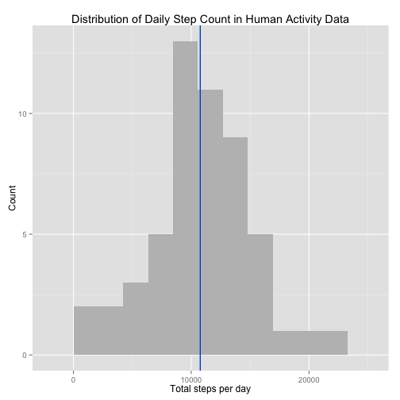
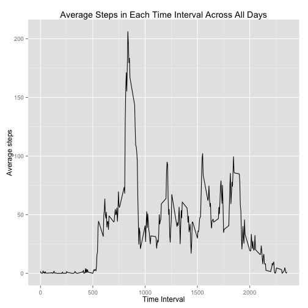
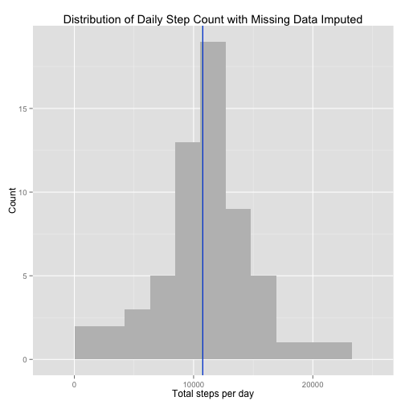
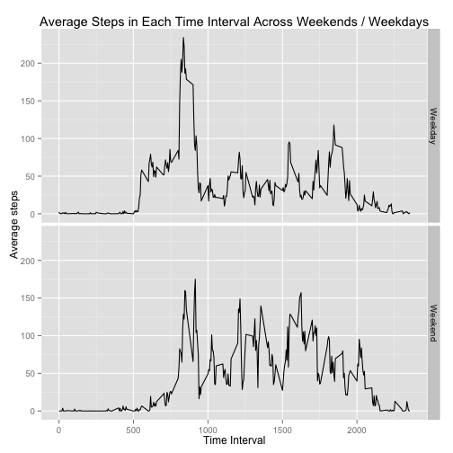

## Loading and preprocessing the data

The source data is available from https://d396qusza40orc.cloudfront.net/repdata%2Fdata%2Factivity.zip The zip file has been included in this repository for you convenience.

To use the data, unzip the provided file and load the data into a dataframe.


```r
unzip("activity.zip")
activityData <- read.csv("activity.csv")
```

Inspect the data to determine if it loaded correctly


```r
str(activityData)
```

```
## 'data.frame':	17568 obs. of  3 variables:
##  $ steps   : int  NA NA NA NA NA NA NA NA NA NA ...
##  $ date    : Factor w/ 61 levels "2012-10-01","2012-10-02",..: 1 1 1 1 1 1 1 1 1 1 ...
##  $ interval: int  0 5 10 15 20 25 30 35 40 45 ...
```

read.csv interpreted the dates as factors.  That might not be the most useful data format.  To fix this re-read the data specifying the datatypes for each column.  Then convert the 'date' character string to a POSIXct date.

Also make sure NAs are handled correctly.  In this data they appear as the string "NA".


```r
library(lubridate)
colClasses <- c("integer", "character", "integer")
activityData <- read.csv("activity.csv", colClasses=colClasses, na.strings="NA")
activityData$date <- ymd(activityData$date)
str(activityData)
```

```
## 'data.frame':	17568 obs. of  3 variables:
##  $ steps   : int  NA NA NA NA NA NA NA NA NA NA ...
##  $ date    : POSIXct, format: "2012-10-01" "2012-10-01" ...
##  $ interval: int  0 5 10 15 20 25 30 35 40 45 ...
```

## What is mean total number of steps taken per day?

To determine the mean total number of steps per day, first sum the steps taken each day.  


```r
library(dplyr)
total_steps_by_date <- na.omit(activityData) %>% 
  group_by(date) %>% 
  summarise(total_steps=sum(steps, na.rm=TRUE))
```


The histogram below shows the distribution of steps made in a day.  The mean value, 1.0766 &times; 10<sup>4</sup>, is represented by the green line while the median value, 10765, is represented by the blue line.


```r
library(ggplot2)

ggplot(data=total_steps_by_date, aes(x=total_steps)) + 
  geom_histogram(binwidth=diff(range(total_steps_by_date$total_steps))/10, fill="grey") +
  labs(title="Distribution of Daily Step Count in Human Activity Data") +
  xlab("Total steps per day") +
  ylab("Count") +
  geom_vline(xintercept = mean(total_steps_by_date$total_steps), colour="green")   +
  geom_vline(xintercept = median(total_steps_by_date$total_steps), colour="blue")
```

 


## What is the average daily activity pattern?

A daily pattern of activity can be determined by grouping the data by the daily time intervals

To determine the mean total number of steps per day, first sum the steps taken each day.  As NA values appear in every time interval at some point in the data they must be removed to get the sum of the steps in each interval.


```r
library(dplyr)
average_steps_by_interval <- activityData %>% 
  group_by(interval) %>% 
  summarise(average_steps=mean(steps, na.rm=TRUE))
summary(average_steps_by_interval)
```

```
##     interval      average_steps    
##  Min.   :   0.0   Min.   :  0.000  
##  1st Qu.: 588.8   1st Qu.:  2.486  
##  Median :1177.5   Median : 34.113  
##  Mean   :1177.5   Mean   : 37.383  
##  3rd Qu.:1766.2   3rd Qu.: 52.835  
##  Max.   :2355.0   Max.   :206.170
```

```r
str(average_steps_by_interval)
```

```
## Classes 'tbl_df', 'tbl' and 'data.frame':	288 obs. of  2 variables:
##  $ interval     : int  0 5 10 15 20 25 30 35 40 45 ...
##  $ average_steps: num  1.717 0.3396 0.1321 0.1509 0.0755 ...
##  - attr(*, "drop")= logi TRUE
```

They daily activity can be represented with a time series plot of average step count in each interval.


```r
library(ggplot2)

qplot(interval, average_steps, data=average_steps_by_interval, geom='line', xlab="Time Interval",
      ylab="Average steps", main="Average Steps in Each Time Interval Across All Days")
```

 

The time interval with the maximum average activity can be determined by filtering for the row the maximum activity.


```r
maximum_average_activity_df <- filter(average_steps_by_interval, average_steps == max(average_steps))
interval_with_maximum_average_activity <- as.vector(maximum_average_activity_df$interval)
interval_with_maximum_average_activity
```

```
## [1] 835
```

The maximum average activity occurs on time interval 835.

## Imputing missing values

Missing data in the raw data can adversely affect some analyses.  We can quantify this missing data and, in some cases, correct for its effects.


```r
summary(activityData)
```

```
##      steps             date               interval     
##  Min.   :  0.00   Min.   :2012-10-01   Min.   :   0.0  
##  1st Qu.:  0.00   1st Qu.:2012-10-16   1st Qu.: 588.8  
##  Median :  0.00   Median :2012-10-31   Median :1177.5  
##  Mean   : 37.38   Mean   :2012-10-31   Mean   :1177.5  
##  3rd Qu.: 12.00   3rd Qu.:2012-11-15   3rd Qu.:1766.2  
##  Max.   :806.00   Max.   :2012-11-30   Max.   :2355.0  
##  NA's   :2304
```

```r
str(activityData)
```

```
## 'data.frame':	17568 obs. of  3 variables:
##  $ steps   : int  NA NA NA NA NA NA NA NA NA NA ...
##  $ date    : POSIXct, format: "2012-10-01" "2012-10-01" ...
##  $ interval: int  0 5 10 15 20 25 30 35 40 45 ...
```

This data set contains 2304 NAs across 17568 observations.

We can characterize the missing data with histograms showing where it appears throughout the day and on which days it appears.  We can select only the rows with missing data, replace its value with a 1 and create plots similar to those above.


```r
missingActivity <- activityData %>% filter(is.na(steps))
missingActivity$steps <- c(1)

missing_steps_by_interval <- missingActivity %>% 
  group_by(interval) %>% 
  summarise(sum_steps=sum(steps, na.rm=TRUE))
summary(missing_steps_by_interval)
```

```
##     interval        sum_steps
##  Min.   :   0.0   Min.   :8  
##  1st Qu.: 588.8   1st Qu.:8  
##  Median :1177.5   Median :8  
##  Mean   :1177.5   Mean   :8  
##  3rd Qu.:1766.2   3rd Qu.:8  
##  Max.   :2355.0   Max.   :8
```

```r
missing_steps_by_date <- missingActivity %>% 
  group_by(date) %>% 
  summarise(sum_steps=sum(steps, na.rm=TRUE))
summary(missing_steps_by_date)
```

```
##       date                       sum_steps  
##  Min.   :2012-10-01 00:00:00   Min.   :288  
##  1st Qu.:2012-10-26 00:00:00   1st Qu.:288  
##  Median :2012-11-06 12:00:00   Median :288  
##  Mean   :2012-11-01 21:00:00   Mean   :288  
##  3rd Qu.:2012-11-11 00:00:00   3rd Qu.:288  
##  Max.   :2012-11-30 00:00:00   Max.   :288
```

```r
missing_steps_by_date
```

```
## Source: local data frame [8 x 2]
## 
##         date sum_steps
## 1 2012-10-01       288
## 2 2012-10-08       288
## 3 2012-11-01       288
## 4 2012-11-04       288
## 5 2012-11-09       288
## 6 2012-11-10       288
## 7 2012-11-14       288
## 8 2012-11-30       288
```

```r
24*60 == 288*5
```

```
## [1] TRUE
```

Note that 288 is the number of 5-minute data intervals in a day.  This shows data is missing on well-defined date boundaries.  Where missing data appears, it is missing for the entire date.  Where data is present it is present for the entire day.

To impute the missing data, we can replace each steps NA value set the average number of steps taken in the time interval. This will replace each missing day with an "average day". I computed the average_steps_by_interval object above.  I'll reuse that here.


```r
imputedActivity <- activityData
imputedActivity$steps <- ifelse(is.na(imputedActivity$steps), 
  average_steps_by_interval$average_steps, 
  imputedActivity$steps)
summary(imputedActivity)
```

```
##      steps             date               interval     
##  Min.   :  0.00   Min.   :2012-10-01   Min.   :   0.0  
##  1st Qu.:  0.00   1st Qu.:2012-10-16   1st Qu.: 588.8  
##  Median :  0.00   Median :2012-10-31   Median :1177.5  
##  Mean   : 37.38   Mean   :2012-10-31   Mean   :1177.5  
##  3rd Qu.: 27.00   3rd Qu.:2012-11-15   3rd Qu.:1766.2  
##  Max.   :806.00   Max.   :2012-11-30   Max.   :2355.0
```

```r
str(imputedActivity)
```

```
## 'data.frame':	17568 obs. of  3 variables:
##  $ steps   : num  1.717 0.3396 0.1321 0.1509 0.0755 ...
##  $ date    : POSIXct, format: "2012-10-01" "2012-10-01" ...
##  $ interval: int  0 5 10 15 20 25 30 35 40 45 ...
```

With this revised data set we can rerun the earlier plots


```r
library(dplyr)
total_steps_by_date <- imputedActivity %>% 
  group_by(date) %>% 
  summarise(total_steps=sum(steps, na.rm=TRUE))
```


The histogram below shows the distribution of steps made in a day.  The mean value, 1.0766 &times; 10<sup>4</sup>, is represented by the green line while the median value, 1.0766189 &times; 10<sup>4</sup>, is represented by the blue line.


```r
library(ggplot2)

ggplot(data=total_steps_by_date, aes(x=total_steps)) +
  geom_histogram(binwidth=diff(range(total_steps_by_date$total_steps))/10, fill="grey") +
  labs(title="Distribution of Daily Step Count with Missing Data Imputed") +
  xlab("Total steps per day") +
  ylab("Count") +
  geom_vline(xintercept = mean(total_steps_by_date$total_steps), colour="green")   +
  geom_vline(xintercept = median(total_steps_by_date$total_steps), colour="blue")
```

 

As the imputation of missing data used average values for each interval, it had no effect on the mean or median values of steps per day.

## Are there differences in activity patterns between weekdays and weekends?

To analyze differences between weekends and weekdays we need to use the non-imputated data as the imputation strategy averages across weekdays and weekends.  Further, missing date should be removed from the activityData dataframe before subsetting the data by date/weekday.


```r
activityData$dayType <- ifelse(wday(activityData$date) %in% c(1,7), "Weekend", "Weekday")

total_steps_by_daytype_and_interval <- na.omit(activityData) %>% 
  group_by(dayType, interval) %>% 
  summarise(average_steps=mean(steps, na.rm=TRUE))
```

With the data properly grouped, we can make plots of the daily activity by day-type (weekend vs weekday) and time interval.


```r
qplot(interval, average_steps, data=total_steps_by_daytype_and_interval, 
      facets = dayType ~ ., geom='line', xlab="Time Interval", ylab="Average steps", 
      main="Average Steps in Each Time Interval Across Weekends / Weekdays")
```

 

The data does show a different activity pattern between weekends and weekdays.  The wearer rises earlier on weekedays and is more sedentary in the mid-day of weekdays.  Walking also drops off earlier in the evening on weekdays than the weekend.
